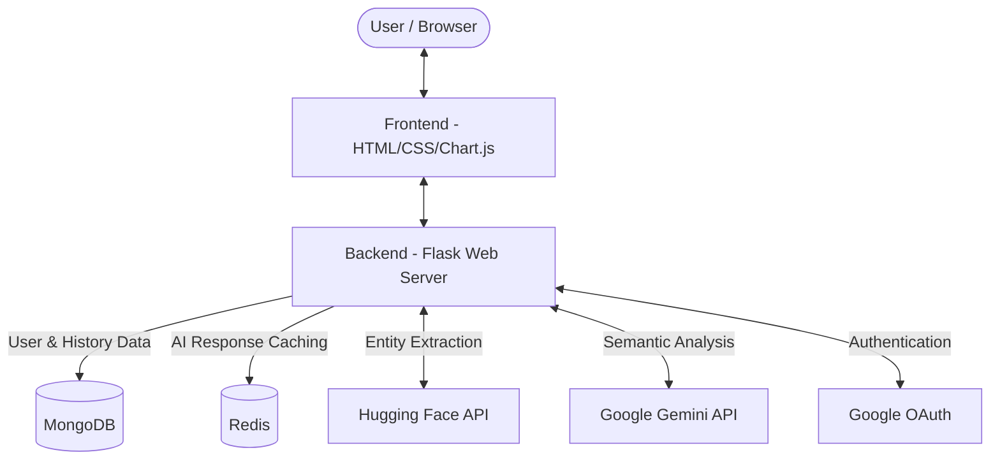

# Resume Analyzer Version 2

Flask-based web application that scores ATS readiness, extracts key resume entities, and optionally compares resume content against a job description.

## Features

- **ATS Score** (0-100) with 6-part breakdown:
  - Contact info (20)
  - Skills section (20)
  - Education section (15)
  - Experience section (15)
  - Action verbs and keywords (20)
  - Resume length (10)
- Resume parsing for PDF, DOCX, and TXT files
- Contact extraction (name, email, phone) using regex and heuristics
- Skills extraction using Hugging Face NER with fallback keyword matching
- Education and work experience extraction using pattern-based parsing
- Optional job match scoring with matched and missing keywords
- Interactive **Chart.js Radar Chart** for visualizing ATS category strengths
- **Advanced PDF Extraction**: Captures hidden hyperlink URIs (GitHub, LinkedIn) directly from document annotations
- Account creation and sign-in using MongoDB
- **Google OAuth Authentication** for seamless sign-in
- Saved analysis history (ATS scores) for signed-in users
- **Fast performance** with parallel API calls and HF cold-start retry logic
- **Redis Caching**: Caches AI responses (Gemini) to make repeated resume analyses almost instantaneous

## Performance Optimizations

This version includes major performance improvements:

1. **HF Model Cold-Start Handling**: Automatic retry logic with exponential backoff for Hugging Face model wake-ups (503 responses)
2. **Parallel Job Matching**: Semantic analysis, section scoring, and requirement coverage run concurrently
3. **Parallel Resume Analysis**: Entity extraction and experience extraction run simultaneously
4. **Loading Overlay**: User sees immediate feedback with animated loading screen and rotating status messages
5. **Flask Threading**: Enabled threaded request handling for concurrent operations

**Result**: 4-6 seconds faster analysis with better UX feedback

## Requirements

- Python 3.8+
- Pip
- Optional but recommended: Hugging Face API key for full NER capabilities

## Setup

1. Install dependencies:

```bash
pip install -r requirements.txt
```

2. Create a .env file (or copy from .env.example):

```env
HF_API_KEY=your_hugging_face_api_key_here
FLASK_ENV=development
MONGO_URI=mongodb://localhost:27017/
MONGO_DB_NAME=resume_analyser
GOOGLE_CLIENT_ID=your_google_client_id
GOOGLE_CLIENT_SECRET=your_google_client_secret
REDIS_URL=redis://localhost:6379/0
GEMINI_API_KEY=your_gemini_api_key_here
```

Notes:
- The app uses HF inference APIs when available
- If HF calls fail, fallback logic still runs for key parts (skills and job matching)
- Free-tier models may have cold-start delays (20-40s first use); automatic retry handles this
- Set `MONGO_URI` to enable account and history features
- Configure `GOOGLE_CLIENT_ID` and `GOOGLE_CLIENT_SECRET` for Google Authentication
- Set `REDIS_URL` to enable caching for external AI API calls
- Set `GEMINI_API_KEY` to enable advanced semantic analysis and job description review

3. Start the app:

```bash
python run.py
```

4. Open your browser to `http://localhost:5000`

## How To Use

1. Upload a resume file (.pdf, .docx, or .txt)
2. Optionally paste a job description
3. Click "Analyse Resume"
4. Review results including:
   - ATS score with detailed breakdown
   - Extracted skills, education, and experience
   - Job match analysis (if job description provided)
   - Suggestions for improvement

## File Validation

- Supported extensions: pdf, docx, txt
- Maximum file size: 5 MB

## Architecture Overview



The application is built using a modern, multi-tier architecture designed for fast and parallel processing:

- **Frontend Interface**: Server-rendered HTML templates via Flask, enhanced with CSS and **Chart.js** for interactive data visualization.
- **Web Application / Backend**: A **Flask** server handling HTTP requests, file uploads, routing, and orchestrating the analysis pipeline. It utilizes threading to run extraction and scoring tasks concurrently.
- **Processing Engine**: A parallelized core that simultaneously executes document parsing (PDF, DOCX, TXT), entity extraction (skills, contact info), and complex ATS scoring heuristics.
- **AI & ML Integration**:
  - **Hugging Face NER**: Leveraged for extracting complex entities like skills. Includes robust handling and retry logic for API cold-starts.
  - **LLM APIs (e.g., Gemini)**: Used for advanced semantic analysis, job matching, and scoring.
- **Data & Caching Layer**:
  - **MongoDB**: Manages user accounts, OAuth authentication data, and stores historical ATS analysis records.
  - **Redis**: Caches external AI API responses to significantly speed up repeated analyses and reduce external API calls.
- **Authentication**: Supports both local account creation (MongoDB) and seamless **Google OAuth** integration.

## Project Structure

```
.
├── run.py                           # Flask app entry point (threaded=True)
├── requirements.txt
├── .env                             # HF_API_KEY configuration
├── vercel.json                      # Vercel deployment config
├── app/
│   ├── __init__.py
│   ├── models/
│   │   ├── __init__.py
│   │   └── db.py
│   ├── routes/
│   │   ├── __init__.py
│   │   ├── auth.py                  # Google OAuth routes
│   │   └── main.py                  # /analyse endpoint with parallel processing
│   ├── services/
│   │   ├── __init__.py
│   │   ├── hf_client.py             # HF API with retry handler
│   │   ├── parser.py                # Resume text extraction
│   │   ├── ats_scorer.py            # ATS scoring logic
│   │   ├── matcher.py               # Job match (parallel tasks)
│   │   ├── experience_extractor.py  # Work/education extraction
│   │   ├── formatting_scorer.py
│   │   ├── readability_scorer.py
│   │   ├── industry_detector.py
│   │   ├── keyword_gap.py
│   │   ├── role_ats_scorer.py
│   │   ├── section_feedback.py
│   │   ├── jd_review.py             # Job description review
│   │   └── analytics.py             # Chart generation
│   ├── templates/
│   │   ├── base.html                # Base template with loading overlay
│   │   ├── index.html               # Upload form
│   │   ├── result.html              # Results dashboard
│   │   ├── history.html             # Analysis history view
│   │   ├── signin.html              # Sign in page
│   │   └── signup.html              # Sign up page
│   ├── static/
│   │   ├── css/style.css
│   │   ├── plots/                   # Generated chart images
│   │   └── uploads/                 # Temp file storage
│   └── utils/
│       ├── __init__.py
│       ├── cache.py                 # Redis caching logic
│       └── helpers.py
```

## API Endpoints

- `GET /` - Home page with resume upload form
- `GET /signup` / `POST /signup` - Create account
- `GET /signin` / `POST /signin` - Sign in
- `GET /auth/login/google` - Sign in with Google
- `GET /auth/callback` - Google OAuth callback
- `GET /logout` - End user session
- `GET /history` - View saved ATS score history (requires sign in)
- `POST /analyse` - Analyze resume and job description
  - Form fields: `resume` (file), `job_description` (optional text)
  - Returns: rendered HTML results page

## Performance Tips

- First run may take 20-40 seconds (HF model cold-start)
- Subsequent runs are much faster (2-5 seconds)
- Job description matching is optional but provides additional insights
- Loading overlay displays progress while analysis is running

## Known Behavior

- Hugging Face free-tier models may sleep after inactivity; first call triggers wake-up (handled automatically)
- If API calls fail, app falls back to local keyword/overlap logic
- Temporary files are automatically cleaned up after analysis

## Deployment Notes

- Flask app runs with `threaded=True` for concurrent request handling
- Compatible with Vercel, Heroku, and other WSGI-compatible platforms
- vercel.json configured for Python runtime


## 📄 License

Distributed under the MIT License. See `LICENSE` for more information.

---

Built with ❤️ by [Premal](https://github.com/PremalBhagat2005)

