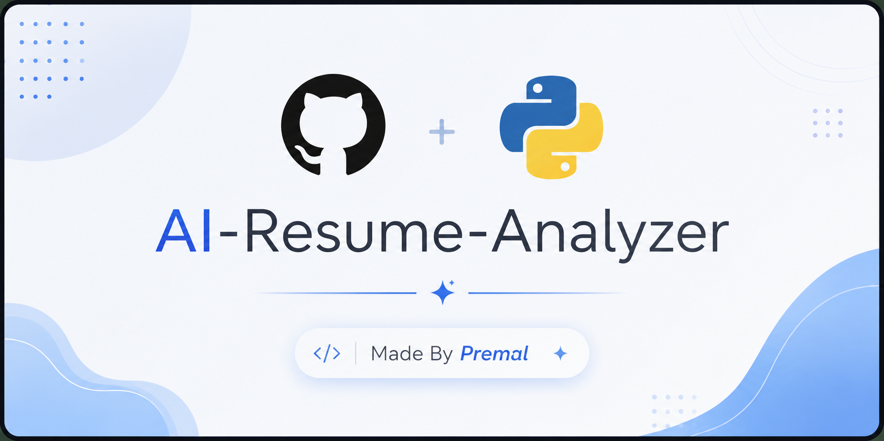
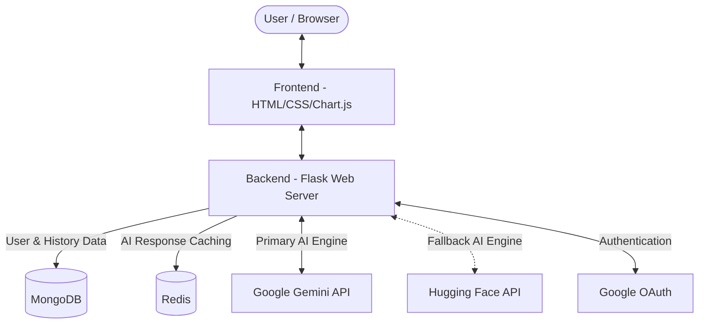

<div align="center">
  <!-- TODO: Replace 'banner.png' with the actual path to your banner image -->
  
</div>

# Resume Analyzer Version 2 (ResumeInsight)

Flask-based web application that scores ATS readiness, extracts key resume entities, and optionally compares resume content against a job description.

## Features

- **ATS Score** (0-100) with 6-part breakdown:
  - Contact info (20)
  - Skills section (20)
  - Education section (15)
  - Experience section (15)
  - Action verbs and keywords (20)
  - Resume length (10)
- Resume parsing for PDF, DOCX, and TXT files
- Contact extraction (name, email, phone) using regex and heuristics
- Skills extraction using Gemini AI with seamless Hugging Face Llama 3 fallback and local keyword matching
- Education and work experience extraction using pattern-based parsing
- Optional job match scoring with matched and missing keywords
- Interactive **Chart.js Radar Chart** for visualizing ATS category strengths
- **Advanced PDF Extraction**: Captures hidden hyperlink URIs (GitHub, LinkedIn) directly from document annotations
- Account creation and sign-in using MongoDB
- **Google OAuth Authentication** for seamless sign-in
- Saved analysis history (ATS scores) for signed-in users
- **Fast performance** with parallel API calls and HF cold-start retry logic
- **Redis Caching**: Caches AI responses (Gemini) to make repeated resume analyses almost instantaneous
- **AI Bullet Rewriting ✨**: Instantly generate professional variations of your work experience and project bullets using AI.
- **Editable Results**: Toggle edit mode to manually refine your extracted resume content directly on the page.
- **ATS-Optimized PDF Export**: Generate and download a clean, single-column ATS-friendly PDF of your updated resume.
- **Tailored Cover Letter Generation ✨**: Automatically draft a highly personalized cover letter using Gemini, weaving in your specific resume skills and experiences to match the targeted Job Description.
- **Premium Glassmorphic UI**: Enjoy a stunning, modern dark-themed interface with smooth animations and interactive components.

## Resilient AI Architecture & Performance

This version includes a robust multi-layered AI system and performance improvements:

1. **Multi-Layer AI Fallback**: Primary requests go to **Google Gemini**. If it fails (quota limits, auth errors), requests automatically fall back to **Hugging Face Llama-3** via the Unified API Router, ensuring the app never breaks.
2. **HF Model Cold-Start Handling**: Automatic retry logic with exponential backoff for Hugging Face model wake-ups (503 responses)
3. **Parallel Job Matching**: Semantic analysis, section scoring, and requirement coverage run concurrently
4. **Parallel Resume Analysis**: Entity extraction and experience extraction run simultaneously
5. **Loading Overlay**: User sees immediate feedback with animated loading screen and rotating status messages
6. **Flask Threading**: Enabled threaded request handling for concurrent operations

**Result**: 4-6 seconds faster analysis with better UX feedback

## Requirements

- Python 3.8+
- Pip
- Recommended: Gemini API key for primary AI features (semantic analysis, cover letter, rewriting)
- Optional: Hugging Face API key as fallback for AI capabilities

## Setup

1. Install dependencies:

```bash
pip install -r requirements.txt
```

2. Create a .env file (or copy from .env.example):

```env
HF_API_KEY=your_hugging_face_api_key_here
FLASK_ENV=development
MONGO_URI=mongodb://localhost:27017/
MONGO_DB_NAME=resume_analyser
GOOGLE_CLIENT_ID=your_google_client_id
GOOGLE_CLIENT_SECRET=your_google_client_secret
REDIS_URL=redis://localhost:6379/0
GEMINI_API_KEY=your_gemini_api_key_here
```

Notes:
- The app primarily uses Google Gemini for advanced AI capabilities.
- The `HF_API_KEY` is used as a highly resilient fallback (defaulting to Llama-3) via the Hugging Face Unified API Router if Gemini is unavailable.
- If Hugging Face also fails, the app safely falls back to local Python regex and keyword matching heuristics.
- Free-tier HF models may have cold-start delays (20-40s first use); automatic retry handles this
- Set `MONGO_URI` to enable account and history features
- Configure `GOOGLE_CLIENT_ID` and `GOOGLE_CLIENT_SECRET` for Google Authentication
- Set `REDIS_URL` to enable caching for external AI API calls
- Set `GEMINI_API_KEY` to enable advanced semantic analysis and job description review

3. Start the app:

```bash
python run.py
```

4. Open your browser to `http://localhost:5000`

## How To Use

1. Upload a resume file (.pdf, .docx, or .txt)
2. Optionally paste a job description
3. Click "Analyse Resume"
4. Review results including:
   - ATS score with detailed breakdown
   - Extracted skills, education, and experience
   - Job match analysis (if job description provided)
   - Suggestions for improvement
5. **Optimize & Edit**: Use the "Rewrite ✨" buttons to improve your bullets, or click "Edit" to tweak the text manually.
6. **Export**: Click "Download ATS PDF" to get a clean, perfectly formatted version of your refined resume.

## File Validation

- Supported extensions: pdf, docx, txt
- Maximum file size: 5 MB

## Architecture Overview



The application is built using a modern, multi-tier architecture designed for fast and parallel processing:

- **Frontend Interface**: Server-rendered HTML templates via Flask, enhanced with CSS and **Chart.js** for interactive data visualization.
- **Web Application / Backend**: A **Flask** server handling HTTP requests, file uploads, routing, and orchestrating the analysis pipeline. It utilizes threading to run extraction and scoring tasks concurrently.
- **Processing Engine**: A parallelized core that simultaneously executes document parsing (PDF, DOCX, TXT), entity extraction (skills, contact info), complex ATS scoring heuristics, and ATS-friendly PDF generation.
- **AI & ML Integration**:
  - **Google Gemini (Primary)**: Used for advanced semantic analysis, job matching, scoring, cover letter generation, and AI bullet rewriting.
  - **Hugging Face Llama-3 (Fallback)**: Leveraged via the Hugging Face Serverless Unified Router API to act as a resilient fallback if Gemini limits are reached. Includes robust handling and retry logic for API cold-starts.
- **Data & Caching Layer**:
  - **MongoDB**: Manages user accounts, OAuth authentication data, and stores historical ATS analysis records.
  - **Redis**: Caches external AI API responses to significantly speed up repeated analyses and reduce external API calls.
- **Authentication**: Supports both local account creation (MongoDB) and seamless **Google OAuth** integration.

## Project Structure

```
.
├── run.py                           # Flask app entry point (threaded=True)
├── requirements.txt
├── .env                             # HF_API_KEY configuration
├── vercel.json                      # Vercel deployment config
├── app/
│   ├── __init__.py
│   ├── models/
│   │   ├── __init__.py
│   │   └── db.py
│   ├── routes/
│   │   ├── __init__.py
│   │   ├── auth.py                  # Google OAuth routes
│   │   └── main.py                  # /analyse endpoint with parallel processing
│   ├── services/
│   │   ├── __init__.py
│   │   ├── hf_client.py             # HF API with retry handler
│   │   ├── parser.py                # Resume text extraction
│   │   ├── ats_scorer.py            # ATS scoring logic
│   │   ├── matcher.py               # Job match (parallel tasks)
│   │   ├── experience_extractor.py  # Work/education extraction
│   │   ├── formatting_scorer.py
│   │   ├── readability_scorer.py
│   │   ├── industry_detector.py
│   │   ├── keyword_gap.py
│   │   ├── role_ats_scorer.py
│   │   ├── section_feedback.py
│   │   ├── jd_review.py             # Job description review
│   │   ├── bullet_rewriter.py       # AI bullet variation generator
│   │   ├── cover_letter.py          # AI cover letter generator
│   │   └── pdf_generator.py         # ATS-friendly PDF builder
│   ├── templates/
│   │   ├── base.html                # Base template with loading overlay
│   │   ├── index.html               # Upload form
│   │   ├── result.html              # Results dashboard
│   │   ├── history.html             # Analysis history view
│   │   ├── signin.html              # Sign in page
│   │   └── signup.html              # Sign up page
│   ├── static/
│   │   ├── css/style.css
│   │   ├── plots/                   # Generated chart images
│   │   └── uploads/                 # Temp file storage
│   └── utils/
│       ├── __init__.py
│       ├── cache.py                 # Redis caching logic
│       └── helpers.py
```

## API Endpoints

- `GET /` - Home page with resume upload form
- `GET /signup` / `POST /signup` - Create account
- `GET /signin` / `POST /signin` - Sign in
- `GET /auth/login/google` - Sign in with Google
- `GET /auth/callback` - Google OAuth callback
- `GET /logout` - End user session
- `GET /history` - View saved ATS score history (requires sign in)
- `POST /analyse` - Analyze resume and job description
  - Form fields: `resume` (file), `job_description` (optional text)
  - Returns: rendered HTML results page
- `POST /api/rewrite-bullet` - AI rewrite generator for resume bullets
- `POST /api/download-ats-pdf` - Generates a clean ATS-friendly PDF from edited data
- `POST /api/generate-cover-letter` - Generates a tailored cover letter using the resume profile and job description

## Performance Tips

- **Redis Caching**: Repeated analyses of the same resume/job description are almost instantaneous.
- First run typically takes 2-5 seconds using the primary Google Gemini API.
- If falling back to Hugging Face, the first run may take 20-40 seconds (HF model cold-start), but subsequent runs are much faster.
- Job description matching is optional but provides deep insights and enables tailored cover letter generation.
- Loading overlay displays real-time progress while parallel analysis tasks are running.

## Known Behavior

- **Primary AI (Gemini)**: May encounter rate limits on the free tier, triggering a seamless fallback to Hugging Face.
- **Fallback AI (Hugging Face)**: Free-tier models may sleep after inactivity; the first fallback call triggers a wake-up (handled automatically with retry logic).
- **Ultimate Fallback**: If all external API calls fail, the app falls back to local Python keyword/overlap logic to ensure uninterrupted service.
- Temporary files are automatically cleaned up immediately after analysis.

## Deployment Notes

- Flask app runs with `threaded=True` for concurrent request handling.
- Compatible with Vercel, Heroku, Render, and other WSGI-compatible platforms.
- `vercel.json` is configured for the Python runtime.
- **External Services**: Ensure MongoDB (for users/history) and Redis (for AI caching) are configured properly (e.g., via MongoDB Atlas and Upstash/Render for cloud deployments).


## 📄 License

Distributed under the MIT License. See `LICENSE` for more information.

---

Built with ❤️ by [Premal](https://github.com/PremalBhagat2005)

